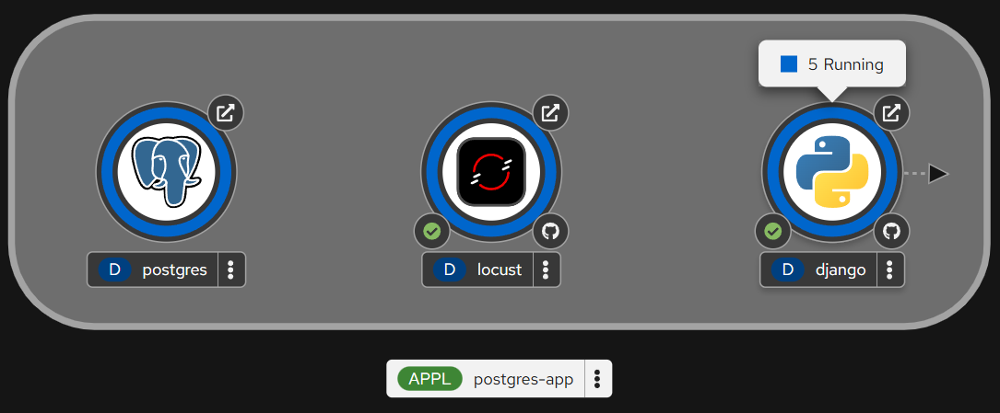
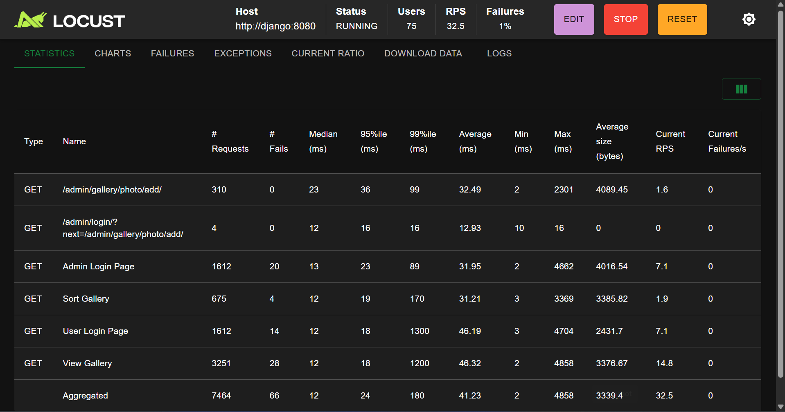
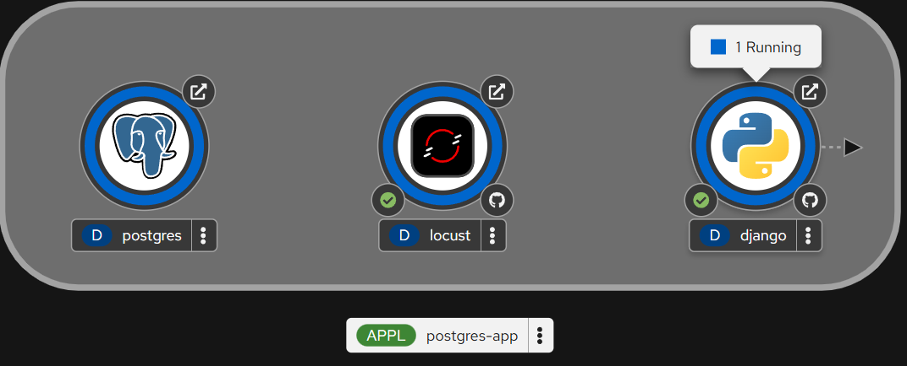

# Load Testing and Auto-scaling Protocol

## Project Information
- **Application**: Photo Album (Django)
- **Platform**: OKD PaaS (fured.cloud.bme.hu)

## 1. Test Objectives
The objective of this performance test is to validate the Horizontal Pod Autoscaler (HPA) configuration and verify that the application can handle increased traffic by scaling from 1 to 5 replicas.

## 2. Test Environment and Tools
- **Load Testing Tool**: Locust 
- **Monitoring**: OKD Web Console (Topology and Metrics views).
- **Target**: Internal Service URL (`http://django:8080`).

### Locust Configuration (`locustfile.py`)
The test script simulates a mix of functional user behaviors:
- **Gallery Access**: Continuous GET requests to the home page (Read-heavy).
- **Authentication Stress**: Accessing the Django admin and login endpoints.
- **Processing Load**: Triggering server-side sorting logic via query parameters.

## 3. Execution Parameters
- **Simulated Users**: 50 concurrent users.
- **Spawn Rate**: 10 users per second.
- **Duration**: Until maximum scale-out (5 replicas) was achieved and stabilized.

## 4. Auto-scaling Evidence
The following behaviors were observed and documented during the test:

### Upscaling Phase
As CPU utilization exceeded the 40% threshold (reaching approximately 85% during the ramp-up), the HPA triggered the creation of additional replicas. The deployment successfully scaled from 1 to 5 Pods.
- **Evidence**: OKD Topology view confirmed "5 of 5 pods" in Running status.

### Stabilization
Once all 5 replicas were operational, the average response time decreased and stabilized, despite the high concurrent user count. The error rate remained at 1% after correcting initial configuration bottlenecks.

### Downscaling Phase
Approximately 5 minutes after the load test was terminated, the HPA observed the drop in CPU utilization (returning to <5%) and began terminating redundant replicas until the count returned to the minimum value (1 Pod).

## 5. Technical Analysis and Lessons Learned

### Storage Access Modes (RWO vs. RWX)
During initial scaling attempts, Pods were stuck in `ContainerCreating` status due to a `Multi-Attach error`. Investigation revealed that the `photo-pvc` used `ReadWriteOnce` (RWO) access mode, preventing multiple Pods on different nodes from mounting the same volume. 
**Solution**: For production scaling with local file persistence, a `ReadWriteMany` (RWX) storage class or an external Object Storage (S3) is required.

### Host Header Validation
Initial test iterations resulted in `400 Bad Request` errors. This was resolved by updating `ALLOWED_HOSTS` in `settings.py` to include the internal service DNS name (`django`), as the Locust tool bypassed the external Route and communicated directly with the Service.