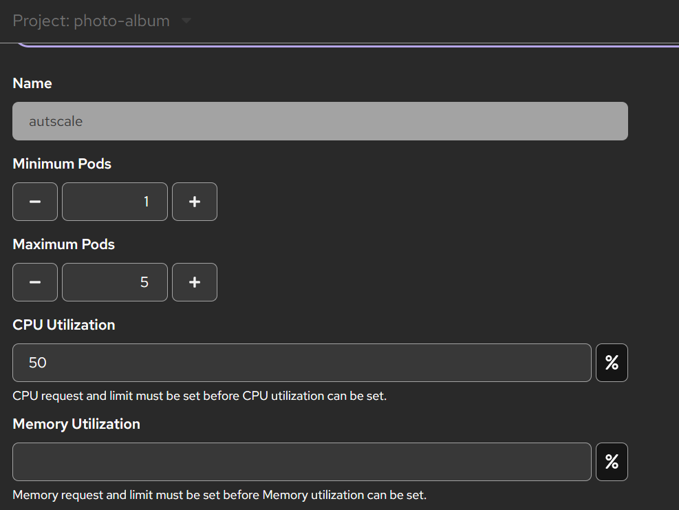

# Photo Album PaaS Application

This project is a multi-tier web application designed for a Cloud Network Services laboratory environment (BMEVITMMB11). The application is built using the Django framework and is deployed on the OKD (Origin Community Distribution of Kubernetes) platform at fured.cloud.bme.hu.

## Architectural Overview

The application follows a cloud-native, multi-tier architecture to ensure separation of concerns, scalability, and data persistence.

### 1. Presentation and Application Tier
- **Framework:** Django
- **WSGI Server:** Gunicorn
- **Static Files:** WhiteNoise is integrated to serve static assets directly through the application server, eliminating the need for a separate Nginx container in this PaaS environment.
- **Security:** Configured to handle SSL termination at the OKD Route level using `SECURE_PROXY_SSL_HEADER` and `CSRF_TRUSTED_ORIGINS`.

### 2. Database Tier
- **Engine:** PostgreSQL 18
- **Deployment:** A standalone containerized database service.
- **Connectivity:** The application connects to the database via an internal Service DNS name, using environment variables for authentication.

### 3. Storage and Persistence Tier
- **Media Storage:** A 1GiB Persistent Volume Claim (PVC) is mounted at `/app/media` to ensure that uploaded photographs are preserved across container restarts and redeployments.
- **Database Persistence:** A separate 1GiB PVC is mounted at `/var/lib/postgresql` for the PostgreSQL service to ensure data integrity and persistence.

## Deployment and CI/CD

The deployment process is fully automated to demonstrate modern DevOps practices.
- **Build Strategy:** The project utilizes a `DockerStrategy` build, using a custom `Dockerfile` based on `python:3.12-slim`.
- **Automation:** GitHub Webhooks are configured to trigger a new build and rolling update automatically upon every code push.
- **Database Migrations:** Database schema synchronization is automated within the container startup command (`python manage.py migrate`).

## Configuration

The application is configured through OKD environment variables:

| Variable | Purpose |
|---|---|
| `DATABASE_URL` | Defines the connection parameters for the PostgreSQL instance. |
| `ALLOWED_HOSTS` | Security filter for the OKD Route domain and internal service names. |
| `CSRF_TRUSTED_ORIGINS` | Ensures secure form submissions over HTTPS. |
| `SECURE_PROXY_SSL_HEADER` | Informs Django about the secure nature of the connection behind the OKD load balancer. |

## Scalability and Auto-scaling

The application tier is designed to be stateless, allowing for horizontal scalability.

### Resource Constraints
To facilitate auto-scaling, the Django deployment is restricted by the following resource quotas:
- **CPU Request/Limit:** 100m / 200m
- **Memory Request/Limit:** 128Mi / 256Mi

### Horizontal Pod Autoscaler (HPA)
An HPA is configured to monitor the application tier:
- **Replica Range:** 1 (minimum) to 5 (maximum).
- **Scaling Trigger:** Average CPU utilization exceeding 40%.
- **Mechanism:** The OKD controller automatically instantiates new Pods when the load increases and terminates them after a cool-down period once traffic subsides.

## Management Commands
Administrative tasks can be performed via the OKD Pod Terminal:
- **Create Administrative User:** `python manage.py createsuperuser`
- **Manual Migration:** `python manage.py migrate`